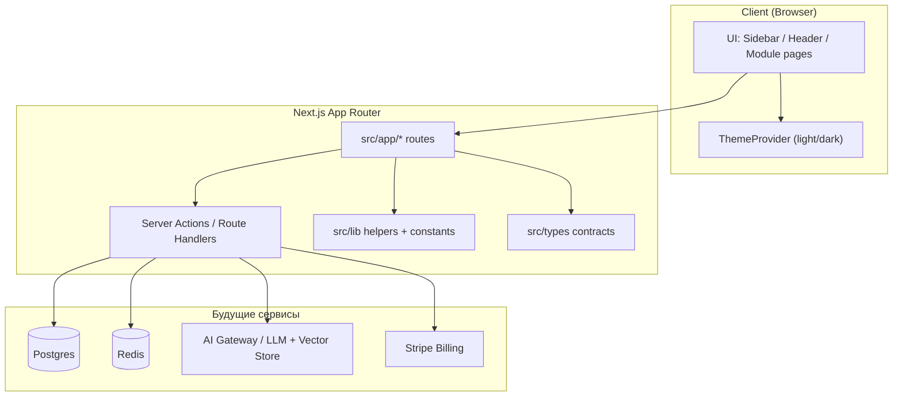

# Nexus Platform

Модульная SaaS-платформа — учебный портфолио-проект. Один общий shell (layout, UI-кит, типы), внутри — пять суб-проектов, которые наращиваются независимо.

## Что уже есть

- Next.js 14 (App Router) + TypeScript (strict, без `any`)
- Tailwind CSS, Dark/Light тема
- Lucide React, `clsx` + `tailwind-merge` (`cn`)
- Sidebar / Header / Dashboard с карточками модулей
- **Модуль №1 AI RAG Assistant** на `/ai-assistant` (upload .txt/.pdf, чанки, embeddings, чат)
- API `/api/rag` на Vercel AI SDK (`ai` + `@ai-sdk/openai`)
- Заглушки: `/collaboration`, `/analytics`, `/cli-logs`, `/settings`
- Правила менторства в `.cursorrules` (подробные комментарии на русском)

## Архитектура



### Модули

| Модуль | Маршрут | Идея потока данных |
|--------|---------|--------------------|
| AI RAG Assistant | `/ai-assistant` | Upload → embed → `document_chunks` → `match_chunks` → LLM |
| Real-time Workspace | `/collaboration` | CRDT → WebSocket → Redis → Postgres |
| FinTech Analytics | `/analytics` | Events → aggregations → charts |
| Dev CLI / Logs | `/cli-logs` | Structured logs → collector → UI/CLI |
| Settings / Billing | `/settings` | UI → Server Actions → Postgres + Stripe |

### Структура каталогов

```text
src/
  app/                 # роутинг и страницы
  components/
    ui/                # Button, Card, Input, Badge
    layout/            # AppShell, Sidebar, Header, Theme
    dashboard/         # виджеты обзора модулей
  lib/                 # cn, constants, icons, helpers
  types/               # глобальные TypeScript-контракты
```

## Деплой на Vercel + env для RAG

Проект рассчитан на открытие через Vercel Preview/Production.

В **Vercel → Project → Settings → Environment Variables** задайте:

| Переменная | Обязательно | Зачем |
|------------|-------------|--------|
| `GEMINI_API_KEY` | да | Ключ Google Gemini API (chat + embeddings) |
| `NEXT_PUBLIC_SUPABASE_URL` | для векторов | URL проекта Supabase |
| `NEXT_PUBLIC_SUPABASE_ANON_KEY` | для векторов | Публичный anon key (с RLS) |
| `RAG_CHAT_MODEL` | нет | По умолчанию `gemini-2.5-flash` |
| `RAG_EMBEDDING_MODEL` | нет | По умолчанию `embedding-001` (опционально `text-embedding-004`) |

### Supabase + pgvector

1. Создайте проект на [supabase.com](https://supabase.com).
2. SQL Editor → выполните скрипт `supabase/schema.sql` (расширение `vector`, таблица `document_chunks`, RPC `match_chunks`).
3. Скопируйте Project URL и anon key в env (см. таблицу выше).
4. Клиенты Next.js: `src/lib/supabase/client.ts` (браузер) и `src/lib/supabase/server.ts` (RSC/API).

После сохранения переменных сделайте Redeploy, откройте `/ai-assistant`, загрузите `.txt`/`.pdf` и задайте вопрос.

## Локальный запуск

```bash
# 1. Установка зависимостей
npm install

# 2. Dev-сервер (http://localhost:3000)
npm run dev

# 3. Проверка типов/сборки
npm run lint
npm run build
```

Скопируйте секреты только в локальные env-файлы (они в `.gitignore`):

```bash
cp .env.example .env.local
```

## Первый коммит (если стартуете с нуля)

```bash
git init
git add .
git commit -m "feat: scaffold Nexus Platform modular SaaS shell"
git branch -M main
git remote add origin <URL_ВАШЕГО_РЕПО>
git push -u origin main
```

## Принципы кода

См. `.cursorrules`: каждый модуль, хук и конфиг комментируется на русском с объяснением **что / зачем / как текут данные**; UI, API, типы и бизнес-логика не смешиваются в монолитах.
