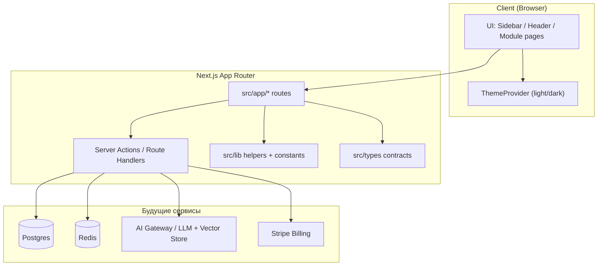

# Nexus Platform

Модульная SaaS-платформа — учебный портфолио-проект. Один общий shell (layout, UI-кит, типы), внутри — пять суб-проектов, которые наращиваются независимо.

## Что уже есть

- Next.js 14 (App Router) + TypeScript (strict, без `any`)
- Tailwind CSS, Dark/Light тема
- Lucide React, `clsx` + `tailwind-merge` (`cn`)
- Sidebar / Header / Dashboard с карточками модулей
- Заглушки маршрутов: `/dashboard`, `/ai-assistant`, `/collaboration`, `/analytics`, `/cli-logs`, `/settings`
- Правила менторства в `.cursorrules` (подробные комментарии на русском)

## Архитектура



### Модули

| Модуль | Маршрут | Идея потока данных |
|--------|---------|--------------------|
| AI RAG Assistant | `/ai-assistant` | Chat → embeddings → vector DB → LLM |
| Real-time Workspace | `/collaboration` | CRDT → WebSocket → Redis → Postgres |
| FinTech Analytics | `/analytics` | Events → aggregations → charts |
| Dev CLI / Logs | `/cli-logs` | Structured logs → collector → UI/CLI |
| Settings / Billing | `/settings` | UI → Server Actions → Postgres + Stripe |

### Структура каталогов

```text
src/
  app/                 # роутинг и страницы
  components/
    ui/                # Button, Card, Input, Badge
    layout/            # AppShell, Sidebar, Header, Theme
    dashboard/         # виджеты обзора модулей
  lib/                 # cn, constants, icons, helpers
  types/               # глобальные TypeScript-контракты
```

## Локальный запуск

```bash
# 1. Установка зависимостей
npm install

# 2. Dev-сервер (http://localhost:3000)
npm run dev

# 3. Проверка типов/сборки
npm run lint
npm run build
```

Скопируйте секреты только в локальные env-файлы (они в `.gitignore`):

```bash
cp .env.example .env.local   # когда появится .env.example
```

## Первый коммит (если стартуете с нуля)

```bash
git init
git add .
git commit -m "feat: scaffold Nexus Platform modular SaaS shell"
git branch -M main
git remote add origin <URL_ВАШЕГО_РЕПО>
git push -u origin main
```

## Принципы кода

См. `.cursorrules`: каждый модуль, хук и конфиг комментируется на русском с объяснением **что / зачем / как текут данные**; UI, API, типы и бизнес-логика не смешиваются в монолитах.
